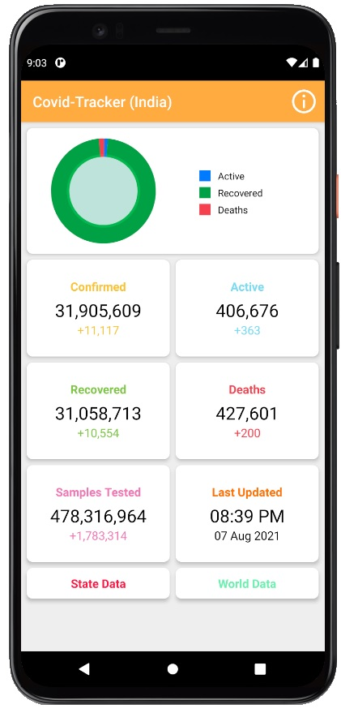
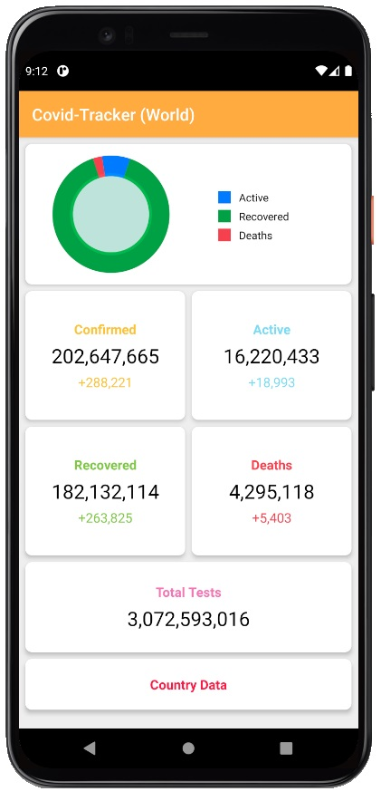
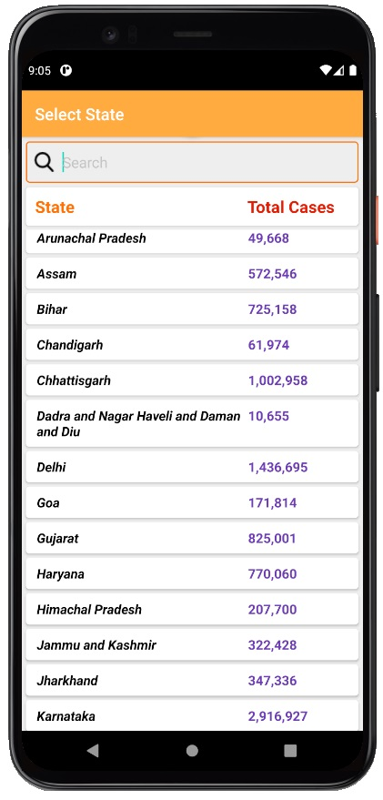
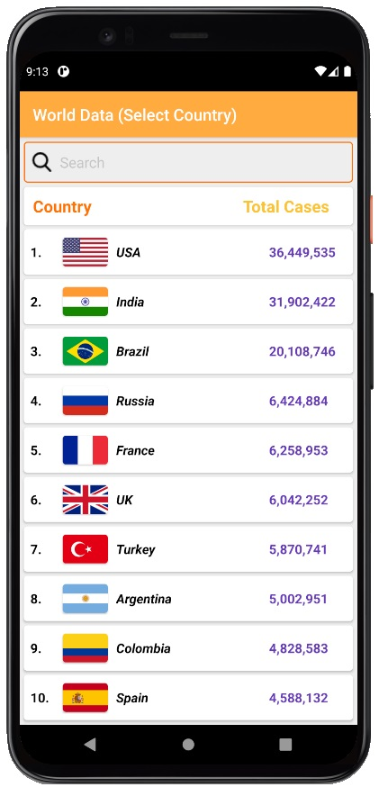
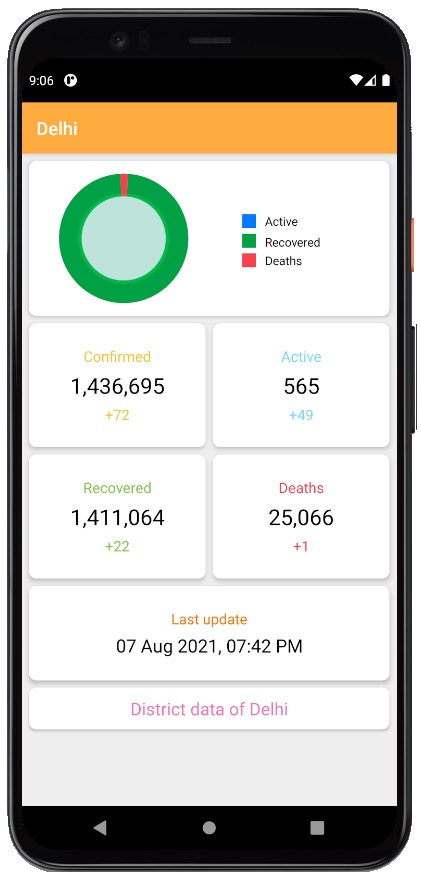
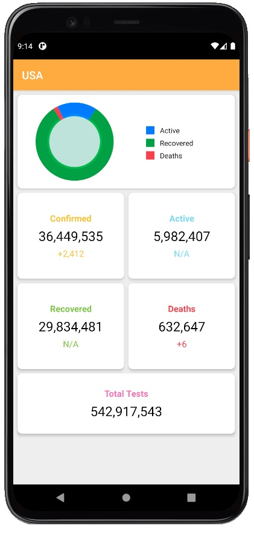

# Covid-Tracker

### This is a java based Covid Tracker App which shows the 
### -Confirmed Covid Cases
### - Active Covid Cases 
### - Recoverd 
### - Death due to covid
### - Sample tested
### for every country and for (INDIA) it also shows state as well as districts data

App Screens
-------
| India data   |World Data      | 
| ------------- | ---------:|
  |      | |

| State List       | Countries List         | 
| ------------- | -----:|
|       |  |

| State Data       | Country Data         | 
| ------------- | -----:|
|       |  |

## Credits
<a href="covid19india.org" />
